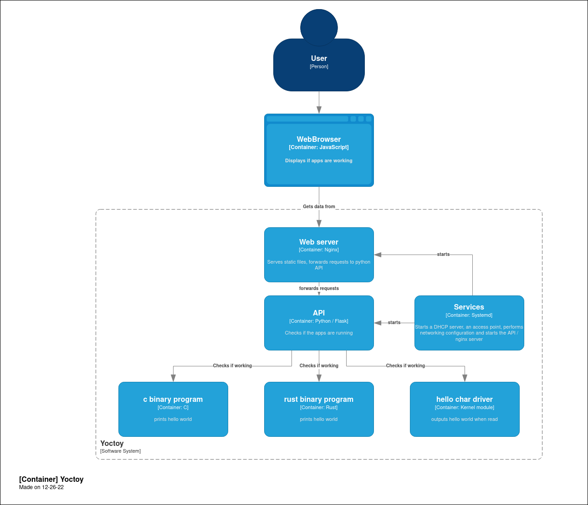
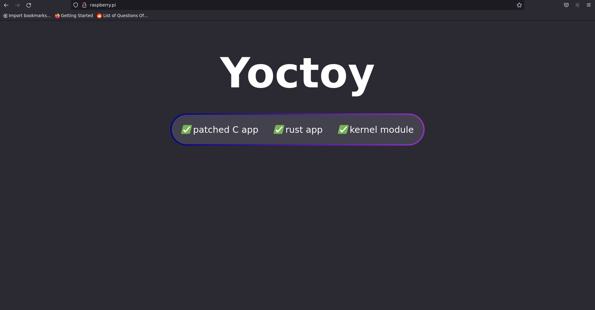

Yoctoy
======

Yoctoy is a self-learning project to learn how to use yocto.
The goal is to make a yocto image for a raspberry pi 3b+.

Usage
-----

Insert your SD card on your computer, and `bzcat yoctoy-raspi3-64.wic.bz2 > /dev/<my sd card>`.  
After turning on the raspberry pi, just connect to the `mysuperwifi` access point and go on `http://raspberry.pi/`.

Building
--------

The image is already built (`yoctoy-raspi3-64.wic.bz2`).

If you want to rebuild it :
```bash
./create_image.sh
```

Issues might occur during the build.
`bitbake -c cleanall <the name of the failed recipe>` might help to fix the issues.

The resulting image is `./yoctoy-raspberrypi3-64.wic.bz2`.

Todo & done
-----------

### Done

* Working raspberry pi 3 image (`meta-yoctoy-app/recipes-images/images/yoctoy.bb`)
* Patched C executable from github (`meta-yoctoy-app/recipes-core/makefile-c-github/`)
* Rust executable (`meta-yoctoy-app/recipes-core/rust-hello-world/`)
* Kernel patch (`meta-kernel/recipes-kernel/`)
* Custom kernel configuration (`meta-kernel/recipes-kernel/`)
* Python API, with dependancies and systemd service (`meta-yoctoy-app/recipes-python-api/`)
* Nginx to serve static content (`meta-yoctoy-app/front-end`)
* Access point with hostapd / static IP with systemd / DHCP-DNS server with dnsmasq (`meta-wifi`)
* Nginx to remove CORS (`meta-yoctoy-app/front-end`)
* Add a random password for the root user
* Read-only filesystem

### Todo

* Dockerize build / use kas
* Make the boot faster (check which systemd service takes time, discard those)
* Modify the netfilter rules to make it more secure (block all ports but used one, no forward)
* Add a wifi password (dnsmasq)

Pictures
--------


